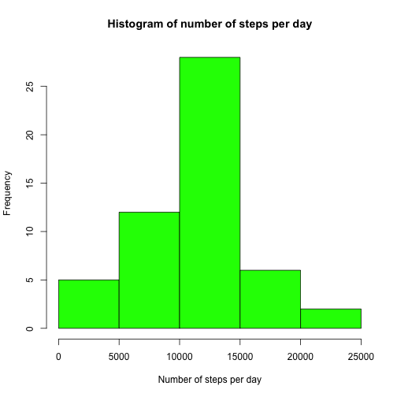
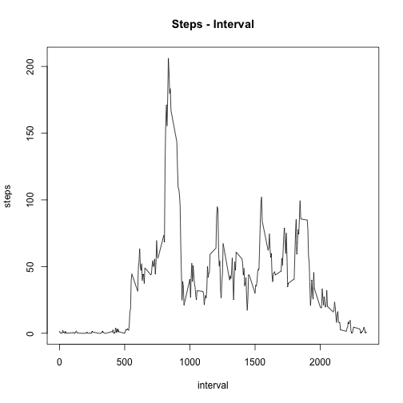
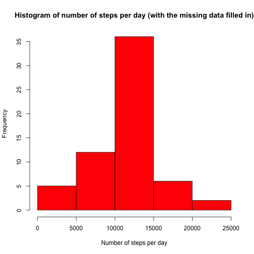
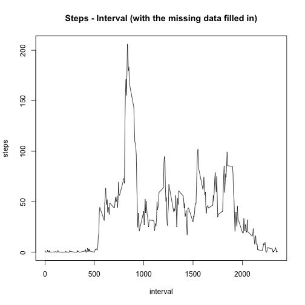
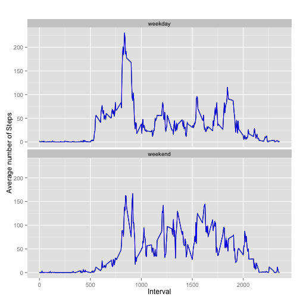

## Loading and preprocessing the data
- Load data

```r
unzip("activity.zip")
rawData <- read.csv("activity.csv")
```

- Process/transform the data (if necessary) into a format suitable for your analysis

```r
sumSteps <- aggregate(steps ~ date, data = rawData, sum, na.rm = TRUE)
```


## What is mean total number of steps taken per day?
- Make a histogram of the total number of steps taken each day

```r
hist(sumSteps$steps,col="green",xlab="Number of steps per day",main="Histogram of number of steps per day")
```

 

- Calculate and report the mean and median of the total number of steps taken per day

Mean of total number of steps per day

```r
# mean
mean(sumSteps$steps)
```

```
## [1] 10766.19
```

Median of total number of steps per day

```r
# median
median(sumSteps$steps)
```

```
## [1] 10765
```


## What is the average daily activity pattern?
- Make a time series plot (i.e. type = "l") of the 5-minute interval (x-axis) and the average number of steps taken, averaged across all days (y-axis)


```r
stepInterv <- aggregate(steps ~ interval,data=rawData,mean,na.rm=TRUE)
plot(steps ~ interval,data = stepInterv,type="l",main = "Steps - Interval")
```

 

- Which 5-minute interval, on average across all the days in the dataset, contains the maximum number of steps?

```r
maxInterval <- stepInterv[stepInterv$steps==max(stepInterv$steps),]
maxInterval$interval
```

```
## [1] 835
```


## Imputing missing values
- Calculate and report the total number of missing values in the dataset

```r
sumNA <- sum(is.na(rawData$steps))
sumNA
```

```
## [1] 2304
```
The total number of missing values in the dataset is **2304**

- Devise a strategy for filling in all of the missing values in the dataset. The strategy does not need to be sophisticated. For example, you could use the mean/median for that day, or the mean for that 5-minute interval, etc.

**I think the best strategy is to use the mean for that 5-minute interval.**

- Create a new dataset that is equal to the original dataset but with the missing data filled in


```r
# creation of new dataset, called "rawData2", starting from the original one
rawData2 <-data.frame(rawData)
# loop to fill the missing data
for (i in 1:nrow(rawData)){
  if (is.na(rawData$steps[i])){
    currInterval <- rawData$interval[i]
    rawData2$steps[i] <- stepInterv$steps[stepInterv$interval==currInterval]
    }
}
```

- Make a histogram of the total number of steps taken each day and Calculate and report the mean and median total number of steps taken per day. 

```r
sumSteps2 <- aggregate(steps ~ date, data = rawData2, sum)
hist(sumSteps2$steps,col="red",xlab="Number of steps per day",main="Histogram of number of steps per day (with the missing data filled in)")
```

 


```r
# mean2
mean(sumSteps2$steps)
```

```
## [1] 10766.19
```


```r
# median2
median(sumSteps2$steps)
```

```
## [1] 10766.19
```


```r
stepInterv2 <- aggregate(steps ~ interval,data=rawData2,mean)
plot(steps ~ interval,data = stepInterv2,type="l",main = "Steps - Interval (with the missing data filled in)")
```

 

Do these values differ from the estimates from the first part of the assignment?
What is the impact of imputing missing data on the estimates of the total daily number of steps?

**The mean value is the same as before. The reason of this is because I used the 5-minutes interval mean.**

**The median value changed going toward the mean (they have the same value now).**


## Are there differences in activity patterns between weekdays and weekends?
- Create a new factor variable in the dataset with two levels – “weekday” and “weekend” indicating whether a given date is a weekday or weekend day.


```r
# "weekend" = Sunday and Saturday; "weekday" = other days
rawData2$dayType <- ifelse(weekdays(as.Date(rawData2$date)) %in% c('Sunday','Saturday'), "weekend","weekday")
rawData2$dayType <- factor(rawData2$dayType)
stepIntervDayType <- aggregate(steps ~ interval+dayType,data=rawData2,mean)
```

- Make a panel plot containing a time series plot (i.e. type = "l") of the 5-minute interval (x-axis) and the average number of steps taken, averaged across all weekday days or weekend days (y-axis).


```r
library(ggplot2)
qplot(interval, steps, data=stepIntervDayType, geom=c("line"),xlab="Interval", 
      ylab="Average number of Steps", main="") + facet_wrap(~ dayType, ncol=1)+geom_line(colour = "blue")
```

 
